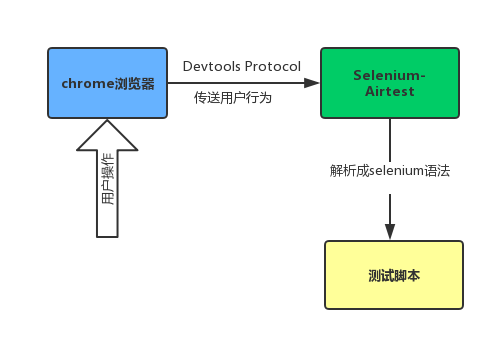

<html>
    <a href="http://airtest.netease.com" class="homepage-corner" aria-label="View source on Github">
        <svg width="100" height="100" viewBox="0 0 250 250" style="fill:#40c9c6; color:#fff; position: fixed; top: 0; border: 0; right: 0;" aria-hidden="true">
            <path d="M0,0 L250,250 L250,0 Z"></path>
            <text x="40" y="40" fill="white" style="font-size: 36px;" size="20" transform="rotate(45 70,70)">Airtest Project</text>
        </svg>
    </a>
    </style>
</html>

## 1.5 web自动化测试

### 前言

[`Selenium`](https://seleniumhq.github.io/selenium/docs/api/py/api.html)是一款web自动化测试框架，它支持各种浏览器，包括 Chrome，Safari，Firefox 等主流浏览器。

得益于Selenium对Python的良好支持，我们在Airtest Project中添加了Airtest-Selenium插件，我们可以使用AirtestIDE进行**web自动化**脚本录制、脚本运行和报告生成。本文将介绍如何使用AirtestIDE进行web自动化测试。

### Airtest-Selenium测试框架原理图

### 录制视频示例

### 相关链接

Airtest-Selenium快速上手教程： http://airtest.netease.com/docs/docs_AirtestIDE-zh_CN/1_quick_start/5_get_started_with_web_test.html

Airtest-Selenium详细文档及API: http://airtest.netease.com/docs/cn/8_plugins/2_selenium.html

